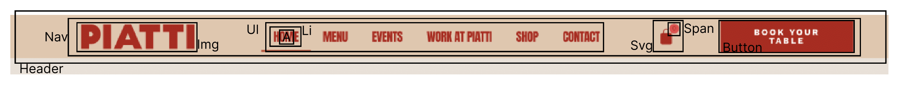
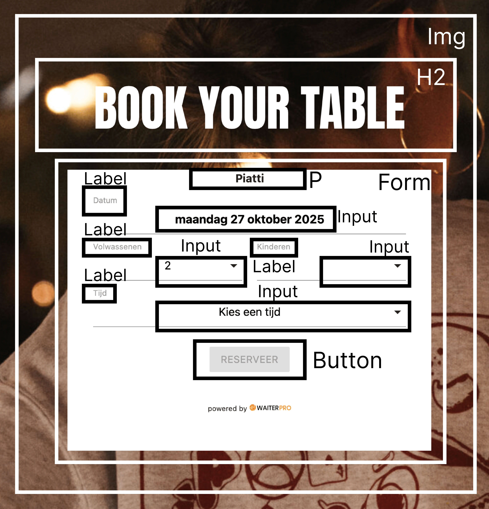
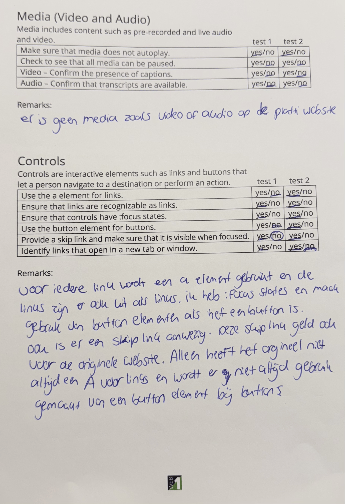
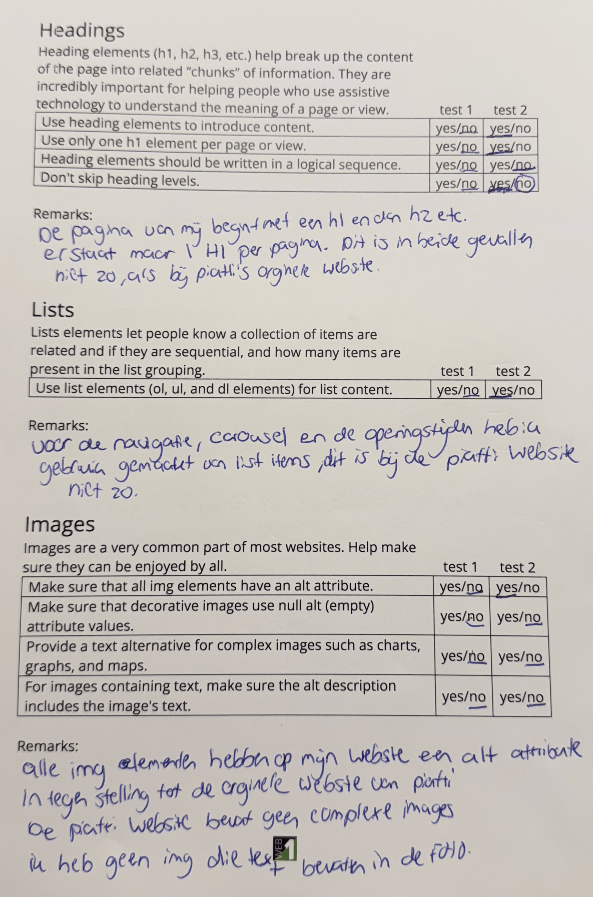
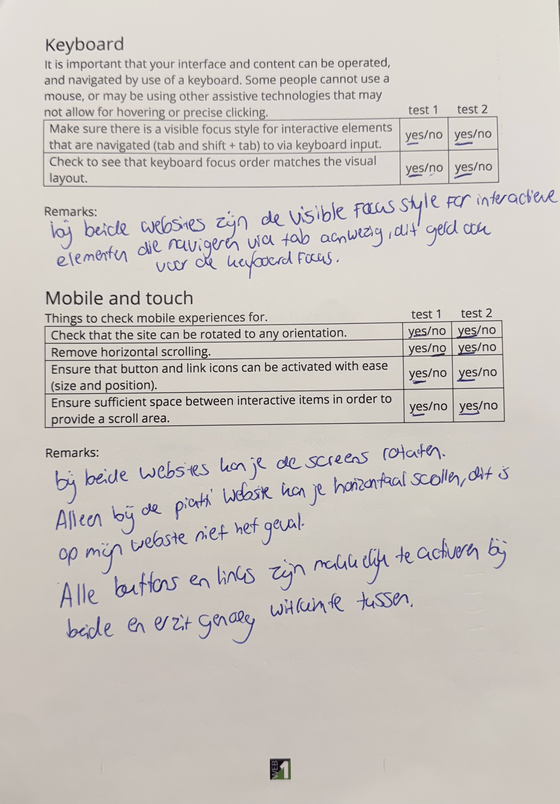
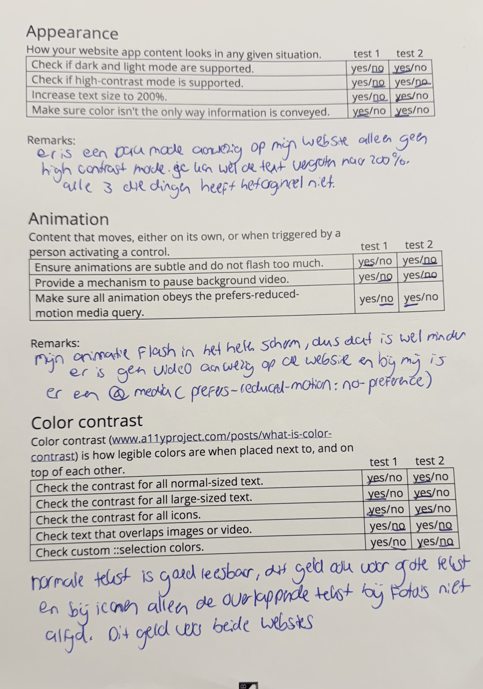
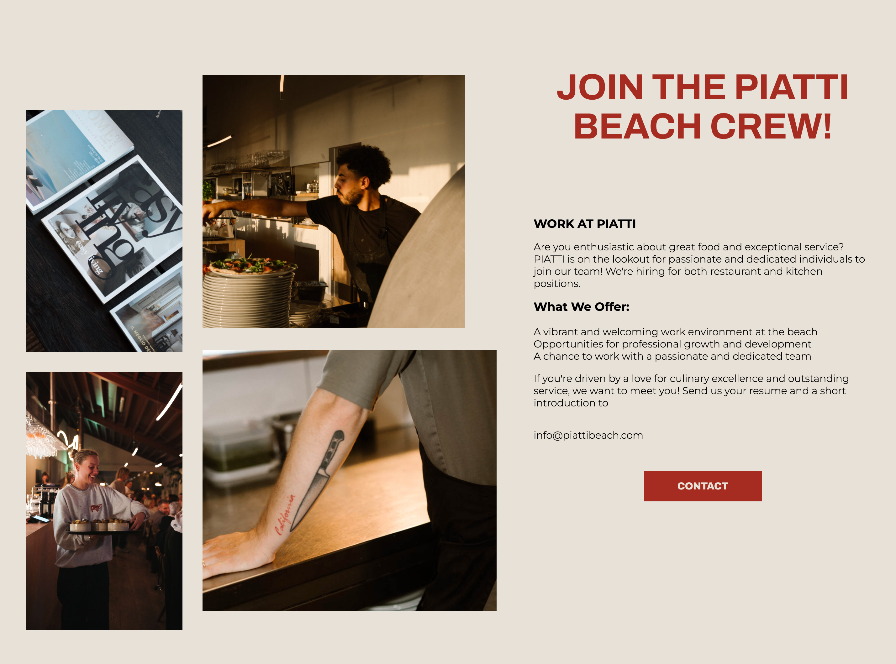
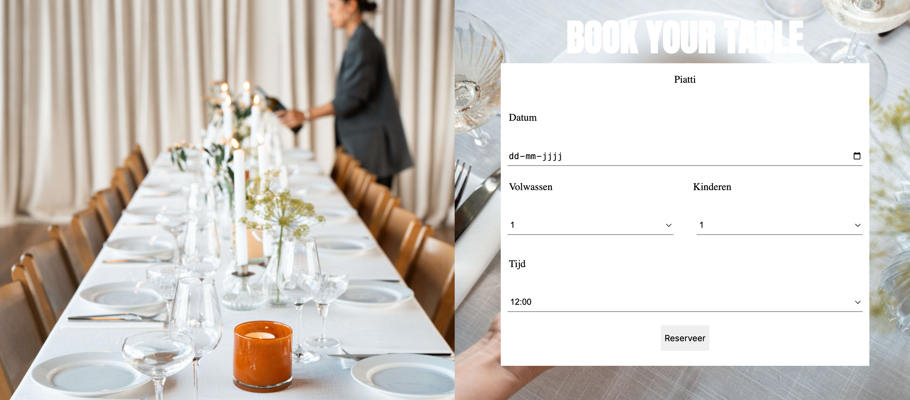
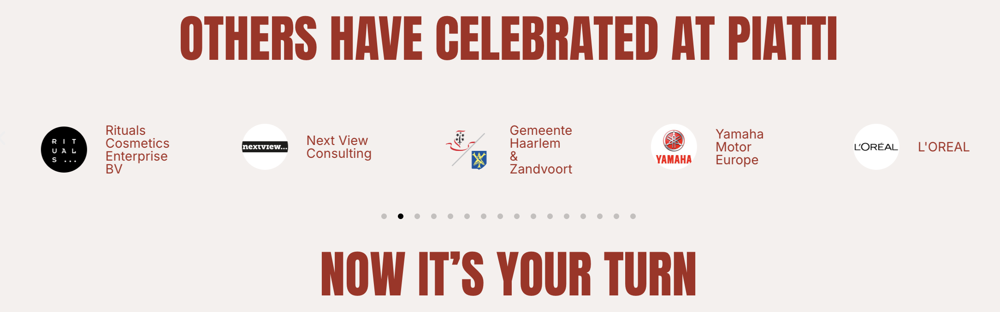
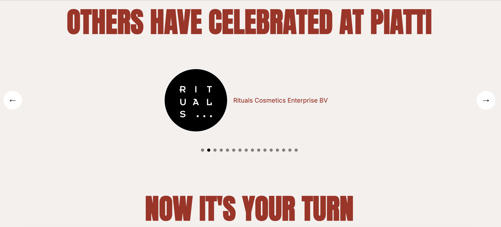

# Procesverslag
Markdown is een simpele manier om HTML te schrijven.  
Markdown cheat cheet: [Hulp bij het schrijven van Markdown](https://github.com/adam-p/markdown-here/wiki/Markdown-Cheatsheet).

Nb. De standaardstructuur en de spartaanse opmaak van de README.md zijn helemaal prima. Het gaat om de inhoud van je procesverslag. Besteedt de tijd voor pracht en praal aan je website.

Nb. Door *open* toe te voegen aan een *details* element kun je deze standaard open zetten. Fijn om dat steeds voor de relevante stuk(ken) te doen.

## Jij

  
uitwerken voor kick-off werkgroep

  ### Auteur:
  Joep Smit
  #### Je startniveau:
  Blauw

  #### Je focus:
  Responsive
 

## Je website

  
uitwerken voor kick-off werkgroep

  ### Je opdracht:
  https://piattibeach.com

  #### Screenshot(s) van de eerste pagina (small screen): 
  Home pagina - Piatti Beach
  

  #### Screenshot(s) van de tweede pagina (small screen):
  Events Pagina - Piatti Beach
  

## Toegankelijkheidstest 1/2 (week 1)

  
uitwerken na test in 2e werkgroep

  ### Bevindingen
  Lijst met je bevindingen die in de test naar voren kwamen:
  1. Content: De taal is duidelijk op de pagina, er zit alleen qua vormgeving niet echt een logica in.
  2. Er worden veel verschillende font gebruikts. 
  3. Buttons zijn niet allemaal hetzelfde.
  4. Een goede HTML structuur is niet aanwezig.
  5. Een unique titel per pagina en zoompoort is aanwezig.
  6. De screenreader werkt niet goed genoeg. De titels worden voorgelezen, maar er is geen alt text bij de foto's
  7. Button en links werken goed. Er zit geen horizontal scrolling op de website.
  8. Er zit in de small screen variant niet altijd genoeg wit ruimte tussen de elementen.
  9. De headings zijn overzichtelijk, alleen is het voormij niet altijd duidelijk of er nu een h2, h3, h4 of een p wordt gebruikt.
  10. Er wordt geen gebruik gemaakt vind list items.
  11. De links zijn bijna allemaal duidelijk te vinden, soms zit er een verstopt in een foto.
  12. Er is geen dark of high contrast mode.
  13. De gebruikte animatie zijn subtiel, ze sliden mooi in het scherm.
  14. De color contrast is aanwezig.

## Breakdownschets (week 1)

  
uitwerken na afloop 3e werkgroep

  ### de hele pagina: 
  

  ### dynamisch deel (bijv menu): 
  

  ### wellicht nog een dynamisch deel (Form voor het reserveren van een tafel bij Piatti): 
  

## Voortgang 1 (week 2)

  
uitwerken voor 1e voortgang

  ### Stand van zaken
  Ik loop op dit moment nog nergens tegen aan. Ik heb mijn html pagina volledig gemaakt en wil nu graag weten hoe ik deze kan gaan stijlen.

  ### Agenda voor meeting
  samen met je groepje opstellen

  | Joep 1          | Casper 2          | Yael 3          | student 4        |
  | ---             | ---               | ---             | ---              |
  | Fontface/family | Zoekbalk          | Hamburgermenu   | ---              |
  | ---             | ---               | ---             | ---              |
  | ...             | ...               | ...             | ...              |

  ### Verslag van meeting
  hier na afloop snel de uitkomsten van de meeting vastleggen

  - Ik weet nu, dat ik per html pagina 1 css pagina moeten maken plus een algemene css
  - je kan een niet zichtbare h1 toevoegen met visually hidden
  - Gebruik voor grootscherm @media
  - Download de fonts op de website en via de inspecter kan je zien welke font bij welke tekst hoort.

## Voortgang 2 (week 3)

  
uitwerken voor 2e voortgang

  ### Stand van zaken
  Font Face is gelukt en ik begin nu een beetje meer te leren over Grid. Ik vind het hamburgermenu erg lastig.

  ### Agenda voor meeting
  samen met je groepje opstellen

  | Casper         | Joep               | Yael         |
  | ---            | ---                | ---          |
  | HamburgerMenu  | HamburgerMenu      | Nav bar      |
  | ...            | Transitie nav bar  | ...          |
  | ...            | ...                | ...          |

  ### Verslag van meeting
  hier na afloop snel de uitkomsten van de meeting vastleggen

  - Ik weet nu hoe ik aan de slag moet met het hamburger menu open klapt
  - Hoe je hamburgermenu naar horiziontale nav bar gaat
  - Hoe je een button laat verschijnen en verwijdenen met Display
  - Hoe je een SVG toevoegt aan je nav bar
  - Wat je met z-index kan doen

## Toegankelijkheidstest 2/2 (week 4)

  
uitwerken na test in 9e werkgroep

  ### Bevindingen
  - Er wordt gebruik gemaakt van plain language op beide websites.
  - De buttons en linksjes zijn unique in beide gevallen.
  - Bij het valideren van de html gaf het origineel veel errors, dit was bij mijn website niet het geval.
  - Lang attributen zijn aanwezig + unique titel
  - Je kan bij beide tabben door de elementen op de website.
  - Bij beide websites kan je het scherm rotaten. 
  - De buttons en links zijn in beide gevallen makkelijk te activeren en er zit genoeg wit ruimte tussen de elementen.
  - De horizontal scrolling is er uit.
  - De origninele website heeft geen heading elementen om de content te introduceren of een 1 h1 per pagina. Dit is nu bij mij verbeterd.
  - Op de originele website wordt geen gebruik gemaakt van list items, dit heb ik verbeterd.
  - Alle img elememnten hebben nu wel een alt element.
  - Alle button elementen worden nu gebruikt voor buttons
  - A elementen worden nu gebruikt voor links.
  - Er is een darkmode nu toegevoegd en de text size kan naar 200%
  - Er is een @media prefers-reduced-motion toegevoegd.
  - De color contrast is aanwezig voor normale en grote tekst.

  - Uitwerking eerste (Week 1) en tweede keer testen (week 9) van de WCAG checklist
  
  
  
  
  

## Voortgang 3 (week 4)

  
uitwerken voor 3e voortgang

  ### Stand van zaken
  Het werken met grid gaat steeds beter en het wil nog niet volledig lukken met het hamburger menu

  ### Agenda voor meeting
  samen met je groepje opstellen

  | Yael           | Casper             | Joep               |
  | ---            | ---                | ---                |
  | Hamburger Menu | Hamburger Menu     | Hamburger Menu     |
  | ...            | ...                | Input              |
  | ...            | ...                | Foto Overlay       |

  ### Verslag van meeting
  hier na afloop snel de uitkomsten van de meeting vastleggen

  - Ik weet nu welke inputs je kan gebruiken
  - De inputs plaats je in een form
  - Foto overlay kan je het best doen in een grid, waarbij je je foto's laat overlapen, door dezelfde colum of row  aan te geven
  - Hoe je een button laat verschijnen en verwijdenen met Display

## Eindgesprek (week 5)

  
uitwerken voor eindgesprek

  ### Je uitkomst - karakteristiek screenshots:
  - 

  - 

  - 

  ### Dit ging goed/Heb ik geleerd: 
  - Wat goed ging was het werken met grid. Deze tool was volledig nieuw voor mij en ik heb nu het gevoel, dat ik het goed beheers. Zo moest ik voor een sectie aan de slag met foto's die allemaal net ander voormaatje hadden, die elkaar niet mochten overlappen, waarbij aan de zijkant de tekst netjes uitgelijnt onder elkaar moest staan. Dit was goed gelukt.
  - 

  - Wat ook goed ging was het maken van een verschillende formulieren en deze in stijl van piatti vormgeven. Ik heb nu geleerd, dat je met input veel verschillende opties hebt om een formulier samen te stellen en verschillende teksten kan toevoegen met een label.
  - 

  ### Dit was lastig/Is niet gelukt:
  - Ik heb geprobeerd een carousel te maken met 5 foto's naast elkaar, die om de paar seconde eentje naar links verplaats en er een nieuwe foto voor in de plaats kwam. Net zoals bij de piatti website, dit is alleen niet gelukt. Ik heb met de code van de carousel opdracht wel een enkele foto carousel gemaakt. Dit was ook de bedoeling voor klein scherm, maar 5 foto's naast elkaar die om de paar seconde en nieuwe foto inbeeld krijgen is niet gelukt. Dit werd met javascrip gemaakt en dit is mij niet gelukt. Ik heb wel pijltjes toevoegt met behulp van de carousel opdracht, die we in de les hebben gedaan. Dit hielp om makkelijker door het carousel heen te gaan i.p.v. dat je op een klein bolletje moet drukken.
  - Dit is wat ik wilde maken:
  - 
  - Dit is wat het is geworden:
  - 

## Bronnenlijst

  
continu bijhouden terwijl je werkt

  Nb. Wees specifiek ('css-tricks' als bron is bijv. niet specifiek genoeg). 
  Nb. ChatGpT en andere AI horen er ook bij.
  Nb. Vermeld de bronnen ook in je code.

  1. Bron Skip to Content link: https://css-tricks.com/how-to-create-a-skip-to-content-link/
  2. Bron Hide Content: https://www.a11yproject.com/posts/how-to-hide-content/
  3. Bron HamburgerMenu Fixed Button: DLO FED - Werkgroep 5 - https://codepen.io/shooft/pen/Qwjaojy
  4. Bron Carousel: DLO FED - Werkgroep 4 Flexbox oefening 4 - https://codepen.io/shooft/pen/QwjQGZe
  5. Bron Label: https://developer.mozilla.org/en-US/docs/Web/HTML/Reference/Elements/label
  6. Bron Input: https://developer.mozilla.org/en-US/docs/Web/HTML/Reference/Elements/input
  7. Bron Textarea: https://developer.mozilla.org/en-US/docs/Web/HTML/Reference/Elements/textarea
  8. Bron Select: https://www.w3schools.com/tags/tag_select.asp
  9. Bron Option: https://developer.mozilla.org/en-US/docs/Web/HTML/Reference/Elements/option
  10. Bron Placeholder: https://www.w3schools.com/tags/att_input_placeholder.asp
  11. Bron Position: https://developer.mozilla.org/en-US/docs/Web/CSS/Reference/Properties/position
  12. Bron uitleg over grid: https://www.w3schools.com/css/css_grid.asp
  13. Bron object-fit: https://developer.mozilla.org/en-US/docs/Web/CSS/Reference/Properties/object-fit
  14. Bron line-height:https://developer.mozilla.org/en-US/docs/Web/CSS/Reference/Properties/line-height
  15. Bron grid fitcontent: https://developer.mozilla.org/en-US/docs/Web/CSS/fit-content_function
  16. Bron Z-index: https://developer.mozilla.org/en-US/docs/Web/CSS/Reference/Properties/z-index
  17. Bron uitleg over VW https://www.w3schools.com/cssref/css_units.php
  18. Bron transform: https://developer.mozilla.org/en-US/docs/Web/CSS/Reference/Properties/transform
  19. Bron gap; https://developer.mozilla.org/en-US/docs/Web/CSS/Reference/Properties/gap
  20. Bron Custom Properties: https://developer.mozilla.org/en-US/docs/Web/CSS/CSS_cascading_variables/Using_CSS_custom_properties
  21. Prefers-color-scheme:dark: uitleg van docent + https://developer.mozilla.org/en-US/docs/Web/CSS/@media/prefers-color-scheme
  22. Bron @font-face: https://developer.mozilla.org/en-US/docs/Web/CSS/@font-face
  23. Bron Intersection observer: https://blog.webdevsimplified.com/2022-01/intersection-observer/ 
  24. Bron max-content: https://developer.mozilla.org/en-US/docs/Web/CSS/max-content 
  25. Bron aling-self:https://developer.mozilla.org/en-US/docs/Web/CSS/Reference/Properties/align-self
  26. bron @Media: https://www.w3schools.com/cssref/atrule_media.php
  27. Uitleg over Object-fit en Display:block Bron ChatGPT: prompt:hoe zeg je dat de foto de hele kolom moet inemen css?
  28. Bron uitleg over transition: https://developer.mozilla.org/en-US/docs/Web/CSS/Reference/Properties/transition
  29. Bron uitleg over text-decoration: https://developer.mozilla.org/en-US/docs/Web/CSS/Reference/Properties/text-decoration
  30. Bron Piatti Beach:https://piattibeach.com

